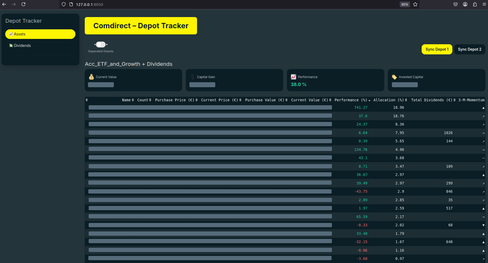
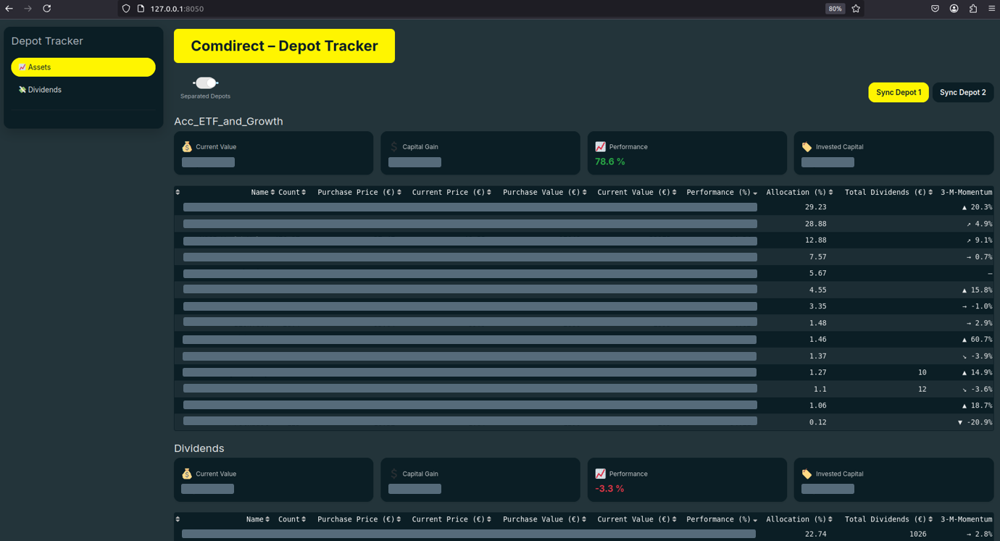
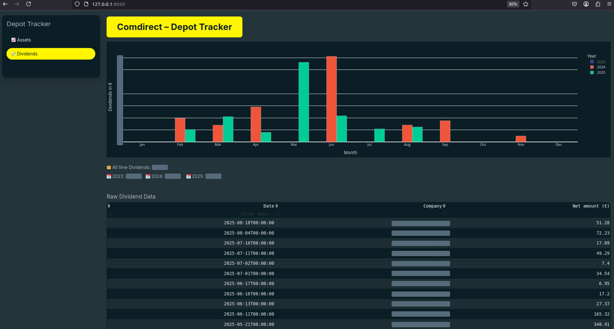

# Comdirect Depot Tracking

Implemented to track my portfolio consisting of multiple Comdirect depots. The main motivation is to automatically track and monitor dividend income, as these features are often locked behind paywall in commonly used portfolio tracking tools like those from Finanzfluss or Parqet. Actually, I want to keep it simple and only add features that really benefit me, so that I don't end up spending hours looking at KPIs unintentionally.

Some new features will be added soon.

## 1. Feature Overview

- Retrieve data from main and secondary Comdirect depots and accounts via Comdirect REST API (Developer Portal). Authenticate via photo TAN.
- List current positions including purchase prices & values, current prices & values, performance and allocation. Current stock prices are retrieved from yfinance.

<center></center>

- Continuously parse account statements to capture and store dividend payments in a persistent local database 
- List total dividends received by a single asset in the depot table
- List the 3-Month-Momentum of an asset. I don't like tracking stock prices all the time. This metric quickly gives me an impression how an asset is currently performing compared to overall market.
- List multiple depots separately or combined in a single portfolio (allocation adapts accordingly)

<center></center>

- Visualizes net dividend income over multiple years
- List dividend income in a table. Filter for specific companies, dates, net amounts.

<center></center>


### 2. Set up your environment

I recommend using a virtual environment:

```bash
python -m venv venv
source venv/bin/activate   # On Windows: venv\Scripts\activate
```

### 3. Install dependencies

```bash
pip install -r requirements.txt
```

### 4. Create a .env with your personal Comdirect access

```bash
# Comdirect API (you need to register specifically for the Comdirect Developer Access to get these secrets)
CLIENT_ID=
CLIENT_SECRET=

# Depot 1 (your normal credentials)
DEPOT_2_NAME= # name used in frontend to identify the depot
USERNAME_1=
PASSWORD_1=

# Depot 2 (your normal credentials)
DEPOT_2_NAME= # name used in frontend to identify the depot
USERNAME_2=
PASSWORD_2=

# currently limited to two depots (only comdirect)

# Mock
# currently not fully tested
# dummy data for showcasing the app without personal depot data (no depot insights)
USE_GENERATED_MOCK_DATA=false
```


### 5. Fill wkn_name_cache.json and wkn_ticker_cache.json

If you want to get name resolution from WKN add your positions to lookup table. 
The wkn_ticker_cache.json is used to update current stock prices (no using the Comdirect API). 

### 6. Run the app and visit: http://127.0.0.1:8050

```bash
python app.py
```