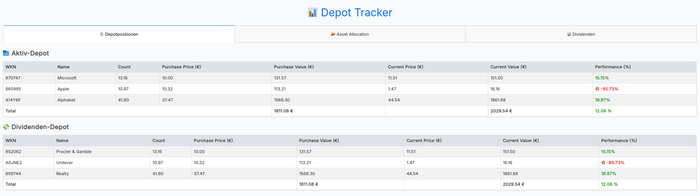
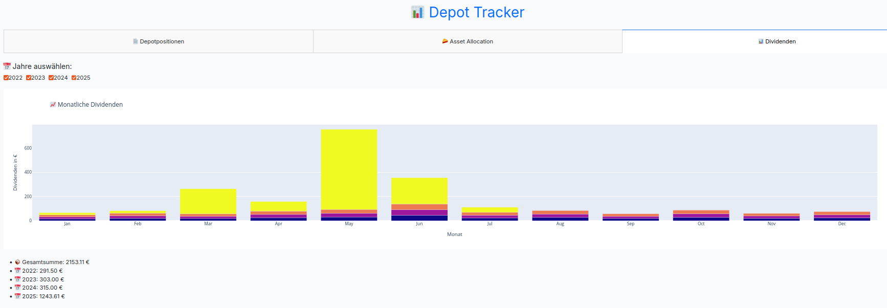

# Depot Tracking Software (Limited to Comdirect currently)

Implemented to track my Comdirect portfolios.The main motivation is to monitor dividend income, as this feature is often locked behind a paywall in commonly used portfolio tracking software like Finanzfluss or Parqet. So far, the app has very limited features and a basic look and feel.

## Features

- Connects to main and secondary Comdirect portfolios/accounts via Comdirect REST API
- Displays current positions  
- Shows asset allocation  
- Continuously parses account statements to capture and store dividend payments in a database  
- Visualizes dividend income over multiple years  


(No real data in the screenshots ;-))






### 2. Set up your environment

I recommend using a virtual environment:

```bash
python -m venv venv
source venv/bin/activate   # On Windows: venv\Scripts\activate
```

### 3. Install dependencies

```bash
pip install -r requirements.txt
```

### 4. Create a .env with your personal Comdirect access

```bash
# Comdirect API
CLIENT_ID=
CLIENT_SECRET=

# Portfolio 1
USERNAME_1=
PASSWORD_1=
ACCOUNT_ID_1=  # Retrieve via API: /banking/clients/user/v1/accounts/balances

# Portfolio 2
USERNAME_2=
PASSWORD_2=
ACCOUNT_ID_2=  # Retrieve via API: /banking/clients/user/v1/accounts/balances

USE_MOCK=false  # true = use mock data for development
```

### 5. Fill data/wkn_name_cache.json 

If you want to get name resolution from WKN add your positions to lookup table

### 6. Run the app and visit: http://127.0.0.1:8050

```bash
python app.py
```